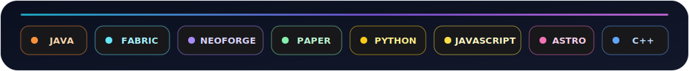

  

  
  
  

## Meow! 🐾

I'm **cat4blep**, a developer from Moscow who likes Minecraft modding, game systems, and small tools with a clear purpose. Most days you'll find me working in Java, making distant worlds feel more alive, or tuning mechanics until they feel natural in play.

- 🔭 Building mods for **Fabric**, **NeoForge**, and **Paper**
- 🧩 Interested in compatibility, configurable systems, and the Create ecosystem
- 🌐 Occasionally wandering into Python, JavaScript, Astro, Electron, and C++
- 💬 Happy to discuss an idea, a bug, or an especially strange mod concept

## Selected work

<table>
  <tr>
    <td width="50%" valign="top">
      <h3><a href="https://github.com/cat4blep/SeeU">SeeU</a></h3>
      
Renders distant players beyond vanilla entity tracking while preserving pose, equipment, name tags, and ridden entities. Built for Fabric/NeoForge clients and Paper/Fabric/NeoForge servers.

      
JAVA · FABRIC · NEOFORGE · PAPER · VOXY · DISTANT HORIZONS

    </td>
    <td width="50%" valign="top">
      <h3><a href="https://github.com/cat4blep/Weight-of-Steel">Weight of Steel</a></h3>
      
A configurable armor-weight system that changes real movement speed without relying on the vanilla Slowness effect, including support for modded armor overrides.

      
JAVA · FABRIC · CONFIGURABLE GAMEPLAY

    </td>
  </tr>
  <tr>
    <td width="50%" valign="top">
      <h3><a href="https://github.com/cat4blep/web-cpu-stress">Web CPU Stress</a></h3>
      
A compact CPU stress-testing tool with a web interface.

      
PYTHON · HTML

    </td>
    <td width="50%" valign="top">
      <h3><a href="https://github.com/cat4blep/pfcweb">pfcweb</a></h3>
      
A web project built with Astro, JavaScript, and CSS.

      
ASTRO · JAVASCRIPT · CSS

    </td>
  </tr>
</table>

## Toolbox

  

## What I'm exploring

Right now I'm especially interested in long-distance rendering, movement and vehicle physics, Minecraft loader interoperability, and the little quality-of-life details that make a mod feel like it belongs in the game.

  <a href="https://github.com/cat4blep?tab=repositories"><b>Explore all repositories →</b></a>
    
  If something here helped you, a star is always appreciated. Thanks for stopping by!

